# Top tres juegos de plataformas que me gustan 
## Archivo creado 22/10/2023 1:31

### Juegos e imagenes:

- Super Mario bros WII
  
  - Este juego en si no tiene historia pero lo que me llama más de este juego es su plataformeo y su increible rejugabilidad que te hace conseguir todos los coleccionables para poder avanzar en los niveles del mundo especial los cuales son un reto para aquellos jugadores experimentados con el juego, ya que estos suponian un gran desafio para jugadores casuales. Este juego me trare muchas nostalgias ya que cuando era pequeño este era el juego estrella para jugar en familia y  me trae muchos recuerdos de jugar con todos mis primos a este juego incluso recordando esto se me vino a la mente que la wii la cogia con ganas porque yo no la tenia y eran mis primos mayores quienes me la prestaban hasta que mis padres me compraron una que venia con este juego al cual de pequeño le eche muchas horas XD

  - Ahora adjuntare algunas imagenes de este juego:
  
  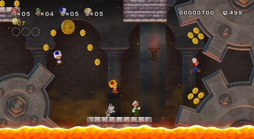
  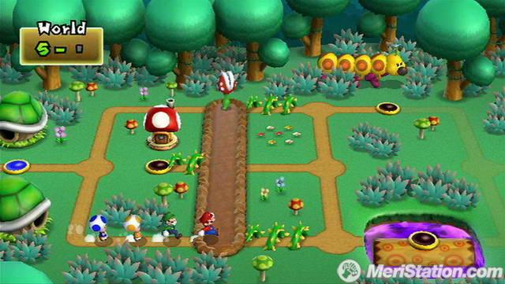
  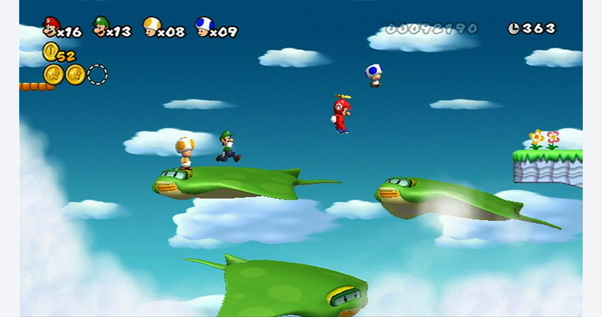

- LittleBigPlanet 
  
  - Es un juego el cual en si como juego es perfecto porque es un juego hecho para que tu sueltes toda tu imaginacion sin ningun tipo de limites personalizando tu personaje, tu nave, cualquier nivel que crees o incluso cualquier nivel ya creado. Este juego es simple, te cuenta la historia de como un muñeco de lana debe salvar el mundo de las imagenes donde reside todas aquellas ideas que tiene el ser humano. Este juego me marco mucho en mi infacia porque gracias a este pude desarrollar mi imaginacion en grandes niveles, aunque toda aquella cosa que creaba era un desastre pero bueno yo me divertia creando niveles, jugando niveles que otros jugadores subian y diseñando a mi muñeco de lana perfecto (para mi yo de aquella epoca).

  - A continuacion adjunto algunas imagenes: 
  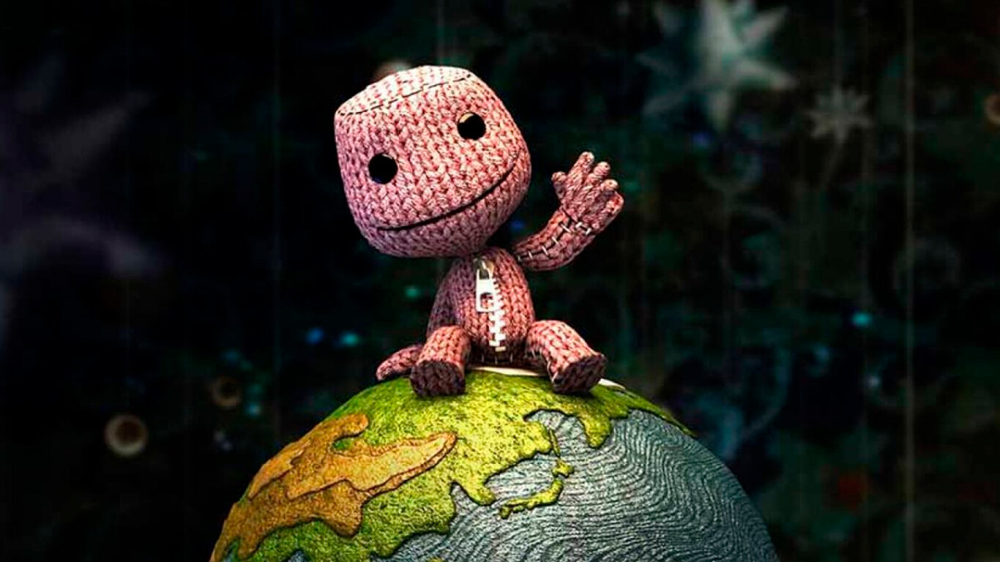   
  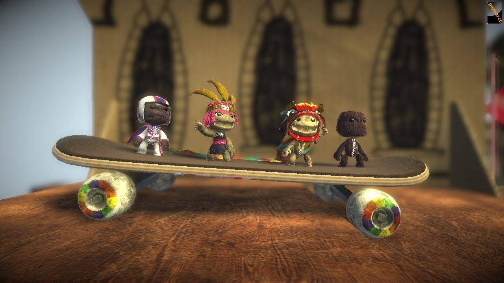
  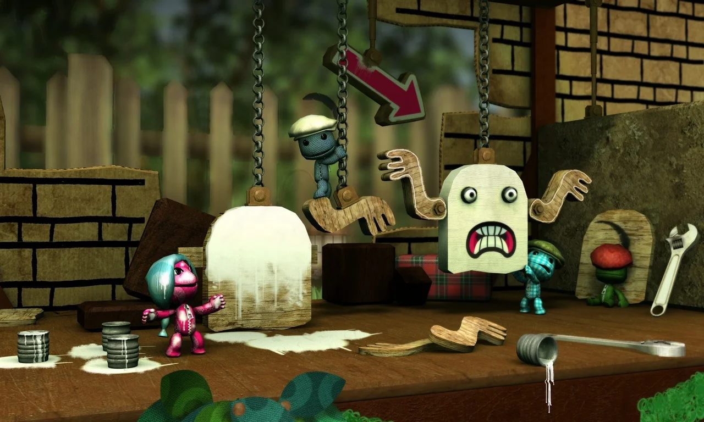
  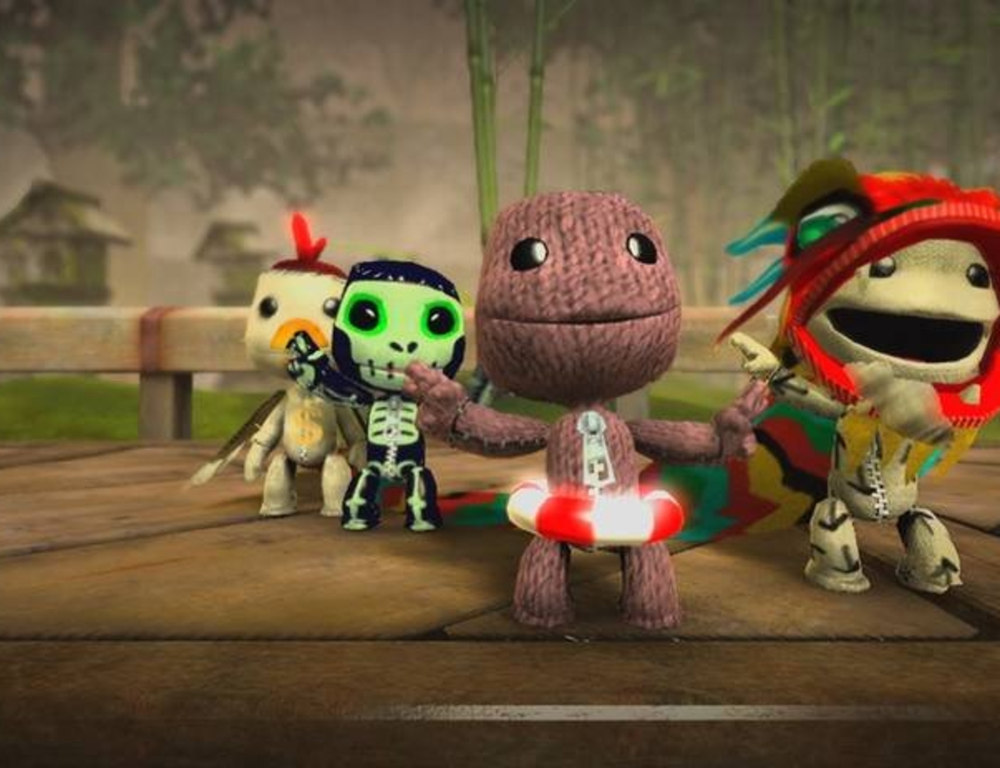

- Super Mario Galaxy 1

  - Este juego fue el primer plataforma 3d de la saga Super Mario que jugue, en si el juego recuerdo que me diverti mucho jugandolo y en cierta forma no tengo ningun recuerdo como en los otros pero de lo que si me acuerdo es de su final el cual es increible tanto su musica como la introduccion a este ultimo nivel lo cual me encanto y se me quedo guardado en el cerebro. Por otro lado la historia de este en si es simple, al igual que los otros juegos de esta saga, este juego nos cuenta como Mario tiene que ir a salvar a la princesa Peach al espacio.

  - A continuacion adjunto algunas imagenes: 
   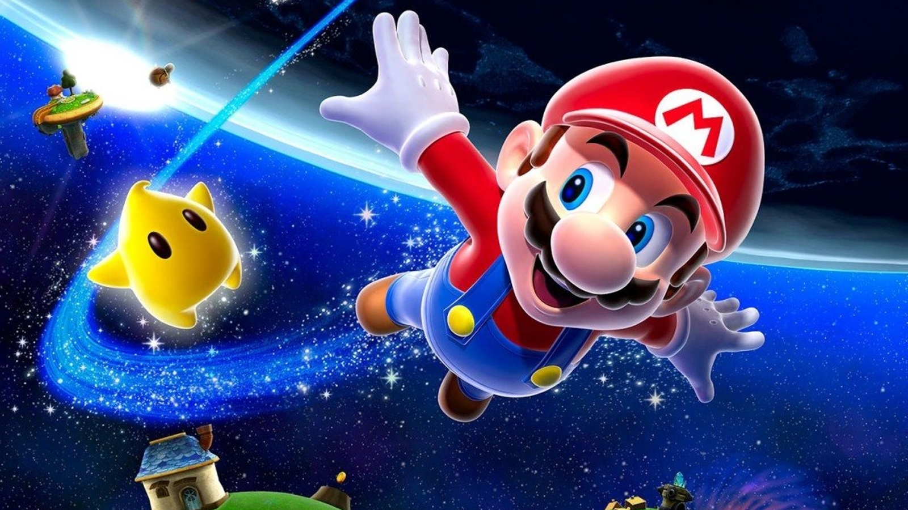
   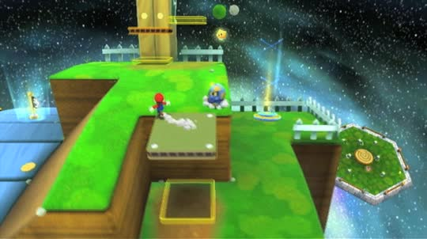
   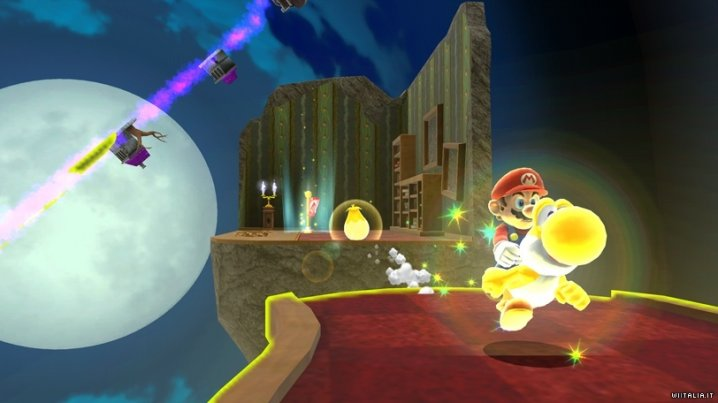
   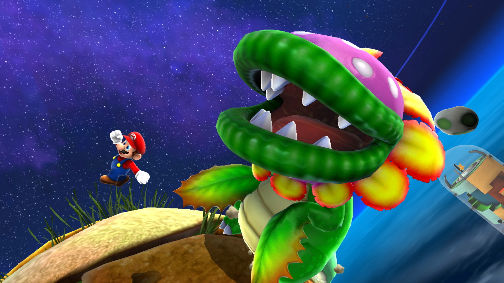

[Index.md](../index.md)