# Top tres shooter que me gustan
## Archivo creado 22/10/2023 3:10

### Juegos e imagenes de estos:

- Call of duty black ops 1 
  
  - Por asi decirlo este juego fue el primer shooter que jugue a los doce años o once (edad a la que me dejaron jugar a estos juegos) no me acuerdo XD y fue porque un amigo mio me lo recomendo y me metia mucha tralla con los zombies cosa que en esos tiempos me aterraba asi que cuando fui ha preguntar a mi padre si lo tenia y le comente que lo iba a juagar con este amigo a lo que el me acompaño arriba a juagarlo y como le dije que iba ha juagar a los zombies el (mi padre) me dejo el cuarto a oscuras y me dijo "juega" y mientras jugaba con mi amigo mi padre a ratos me asustaba para darle tension a la partida. Como estaba comentando antes yo jugue el call of duty black ops por los zombies algo que a lo largo de los tiempos se conviertio en costumbre entre mis amigos hasta hace unos años que deje de juagarlos porque no me llamaban la atencion y porque hay amigos con los que ya no me llevo y otros que no pueden jugar porque los juegos son caros y porque no tienen el tiempo que tenian antes. Por otro lado, me acuerdo que la campaña de este juego me gusto.
  
  - Adjunto imagenes de este juego:
   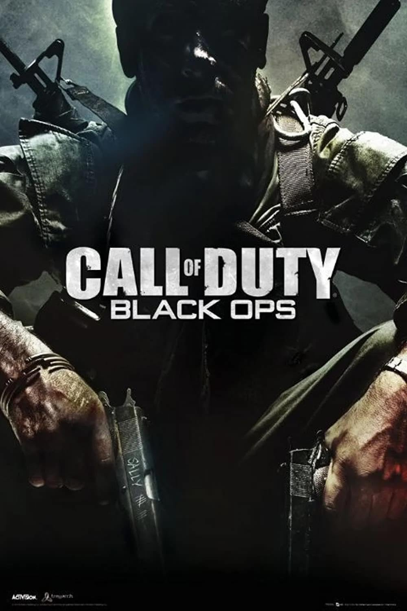
   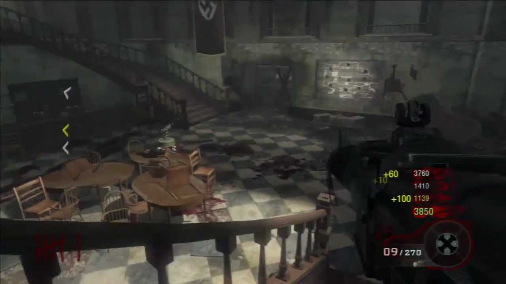 
   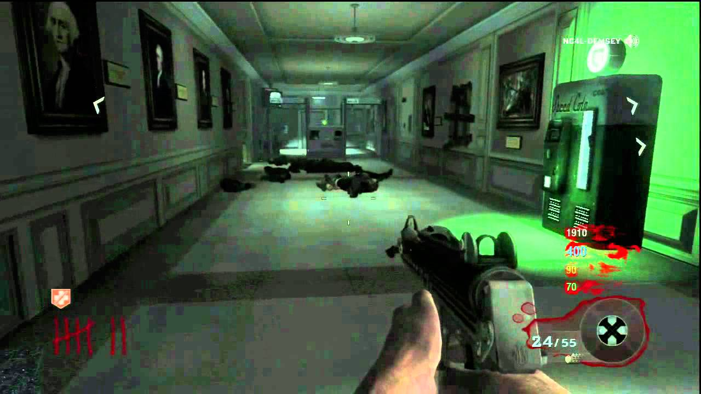
   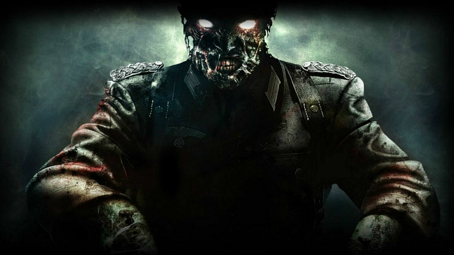

- Call Of Duty Black Ops 2 
  
   - Este juego me  acuerdo que lo compre porque como nos gusto (Yo y mis amigos) el primer black ops pues decidimos comprarnos el segundo y seguir jugando zombies a tope y llegar a la ronda más alta posible hasta que nos hartamos y decidimos hacer los easter eggs de los mapas algo que nos costaba horrores y que intentabamos en muchas ocasiones porque era lo que nos divertia, y por otro lado la campaña a este juego recuerdo no haberle prestado mucha atencion (al menos no tanta como la del black ops 3).

   - Adjunto imagenes de este juego:
    
    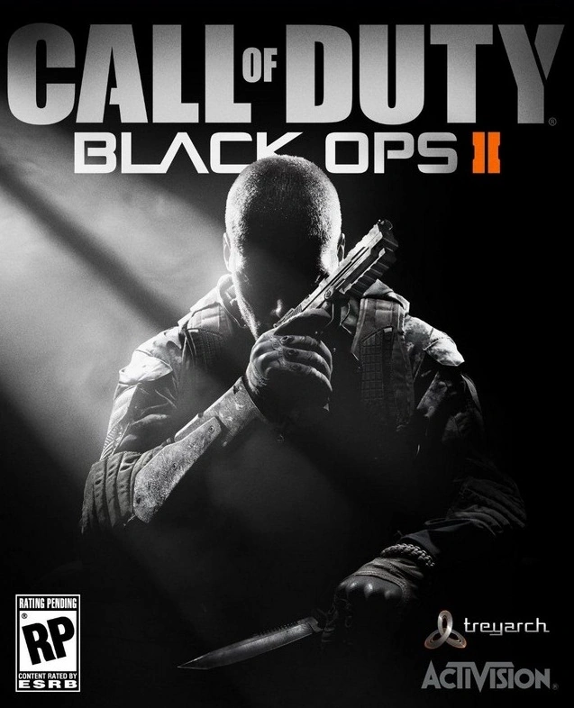
    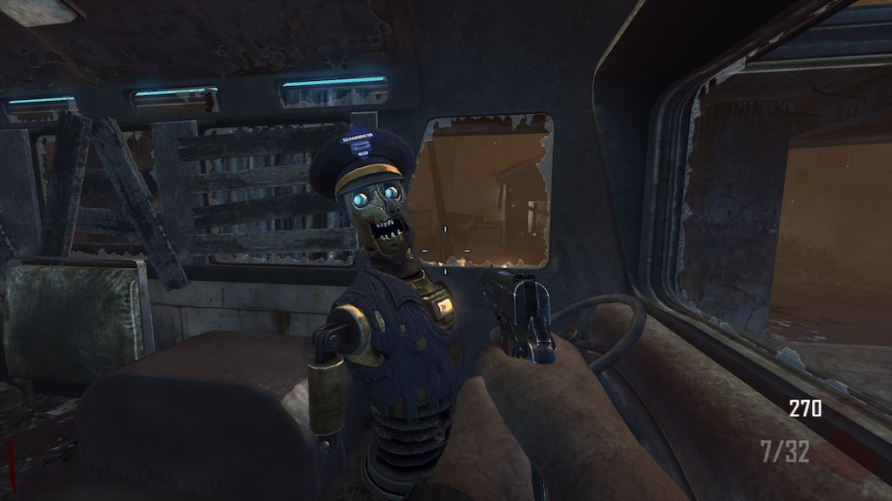
    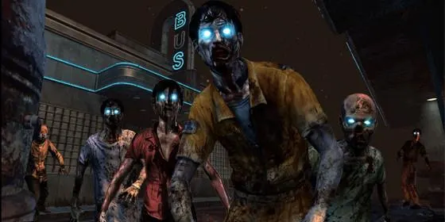
    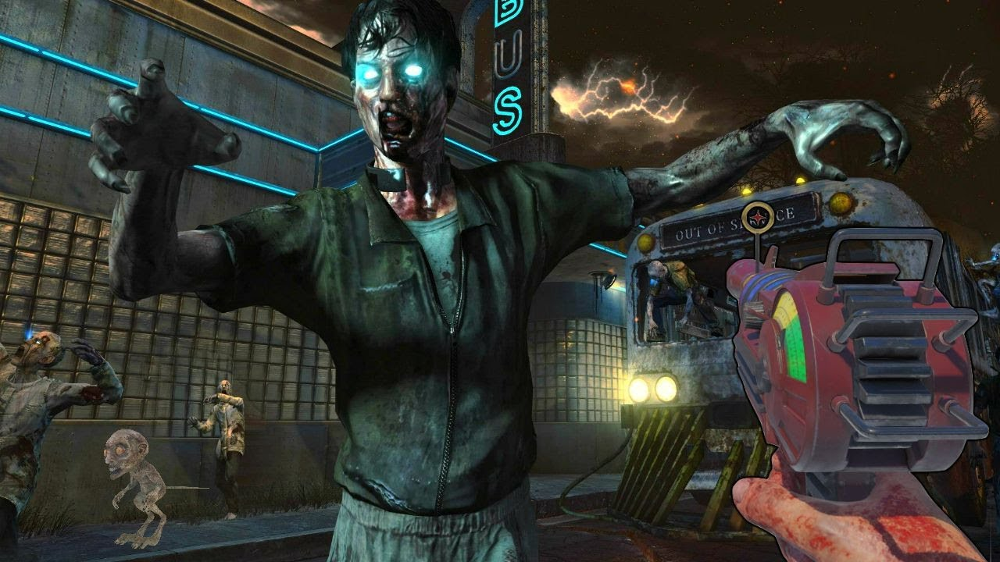

- Call of duty black ops 3

  - Este juego cuando salio el trailer recuerdo esperarlo con muchas ansias, con este juego tuve tantas ganas que fue el primer call of duty en el que consegui varios camuflajes dorados y en el cual llegue al prestigio 7 u 8 (no me acuerdo exactamente) y al cual le dedique tambien mucho tiempoa la campaña. De hecho en este call of duty tambien le dedique muchas horas a los zombies y fue el primer cod en el que me compre un dlc solo para juagar a los zombies y hablando de zombies recuerdo que yo y mis amigos nos sabiamos hacer algunos easter eggs e incluso casi nos hacemos alguno que otro.
  
  - Adjunto imagenes de este juego:

    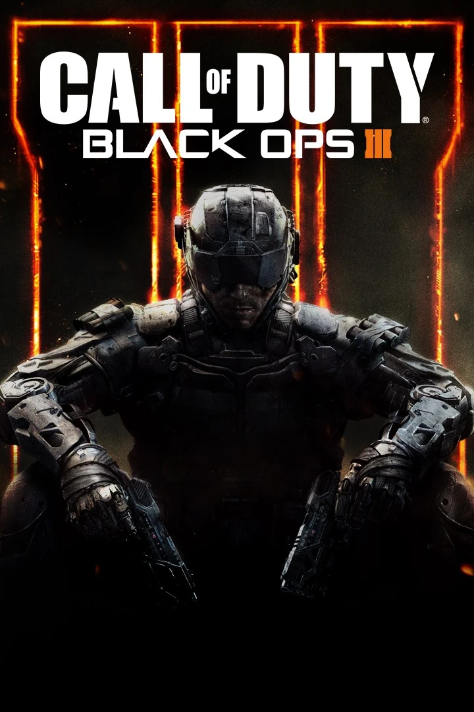 
    
    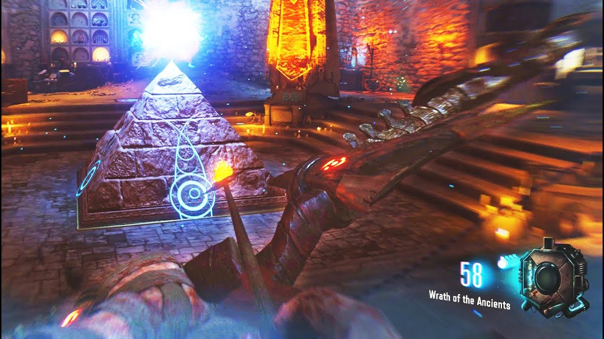
    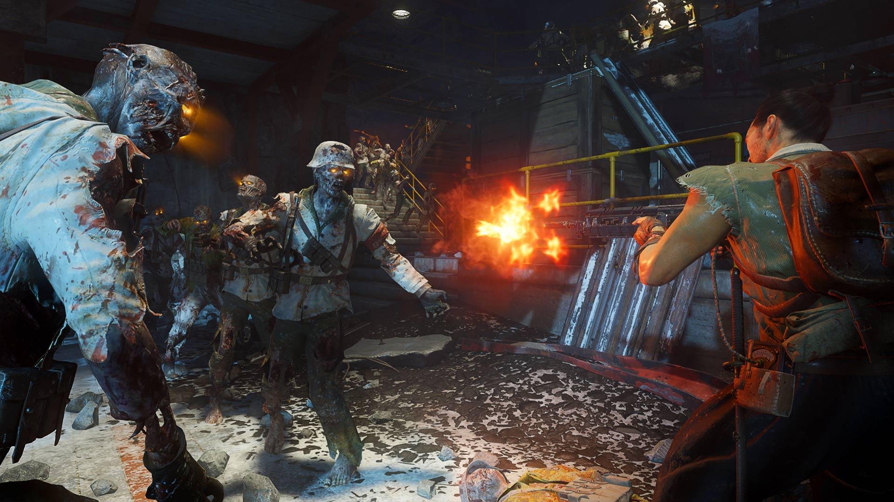

    [index.md](../index.md)